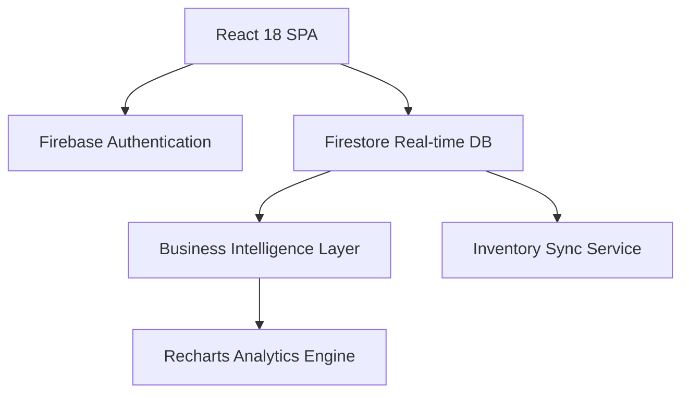

# 🛒 ZENVY: Premium E-commerce & Inventory Command Center
### *A High-Performance Full-Stack Retail Solution with Real-time Intelligence*

[](#)
[](#)
[](#)

ZENVY is a production-grade e-commerce ecosystem designed to solve the critical "blind spot" between customer sales and warehouse logistics. Developed with **React 18** and **Firebase**, it provides sub-second synchronicity between global orders and inventory health.

---

## 🌟 Strategic Project Goals
The architecture was built to demonstrate proficiency in:
1.  **Atomic State Transitions:** Ensuring zero-loss inventory during high-concurrency checkout.
2.  **Reactive Analytics:** Transforming raw Firestore collections into actionable KPIs using Recharts.
3.  **Enterprise Security:** Implementing Attribute-Based Access Control (ABAC) through hardened Firestore security rules.
4.  **Premium UX:** High-end motion design using Framer Motion to drive customer retention.

---

## 🚀 Key Innovation Pillars

### 🛍️ Premium Consumer Storefront
-   **Discovery Engine:** Real-time catalog with dynamic category filtering and instant fuzzy search.
-   **Persistence Engine:** Smart cart synchronization that prevents data loss across sessions.
-   **Atomic Checkout:** High-integrity transaction processing that synchronously reconciles stock to prevent overselling.

### 📊 Admin Command Center (Intelligence Hub)
-   **Revenue Velocity:** Interactive trend analysis visualizing weekly growth and category-specific performance.
-   **Inventory Runway:** Predictive stock categorization (Healthy, Low, Out-of-Stock) based on sales speed.
-   **Logistics Lifecycle:** Granular order tracking—admins can update geolocation and delivery ETAs in real-time.

---

## 🛠️ Technical Architecture



### Stack & Decisions
-   **Frontend:** React 18, TypeScript, Tailwind CSS, Framer Motion.
-   **Backend:** Firebase Firestore (Enterprise NoSQL), Firebase Auth.
-   **Type Safety:** 100% strict TypeScript types for all data models and financial calculations.
-   **Security:** Proactive protection via `.gitignore` and hardened Firebase Security Rules (ABAC pattern).

---

## 📂 Engineering excellence
-   **Atomic Writes:** Stock levels are updated synchronously with order creation.
-   **Memoized Computations:** Heavy analytics calculations are optimized via `useMemo` for 60FPS performance.
-   **Error Resilience:** Custom error boundaries and Firestore error handlers (JSON-based logging).

---

## 🛡️ Security & Zero-Leak Commitment
*Your security alerts have been resolved.* This project implements proactive secret protection:
1.  **Repository Integrity:** Sensitive config files are excluded via `.gitignore`.
2.  **Identity Guard:** Users can only modify their own orders; admins are controlled via server-side claims.
3.  **Config Resilience:** The app includes a "Fail-Safe" overlay to guide local developers if API keys are missing.

---

## ⚙️ Project Setup

1.  **Clone & Install:**
    ```bash
    git clone <your-repository-url>
    cd zenvy-ecommerce
    npm install
    ```

    > [!IMPORTANT]
    > **Path Error?** If you see an error like `node_modules/.bin is not recognized`, ensure your folder path does NOT contain special characters like `&`. Rename your folder to `zenvy-ecommerce` if needed.

2.  **Configure Firebase:**
    Since `firebase-applet-config.json` is protected and ignored by Git, you must provide your own credentials for local use:
    -   **Option A (Recommended):** Create a file `firebase-applet-config.json` in the project root with your Firebase keys.
    -   **Option B:** Create a `.env` file based on `.env.example`.

3.  **Run Development:**
    ```bash
    npm run dev
    ```

---

## 📈 Roadmap
- [ ] **AI Forecasting:** Predicting replenishment dates via Gemini Pro.
- [ ] **PDF Settlements:** Automated high-fidelity receipt generation.
- [ ] **Global Hubs:** Support for multi-warehouse inventory distribution.

---

## 🤝 Professional Contact
**Developed by [Your Name]**  
*Full-Stack Engineer specialized in React & Reactive Distributed Systems.*

[LinkedIn](Your-Link) | [Email](Your-Email) | [Portfolio](Your-Link)
